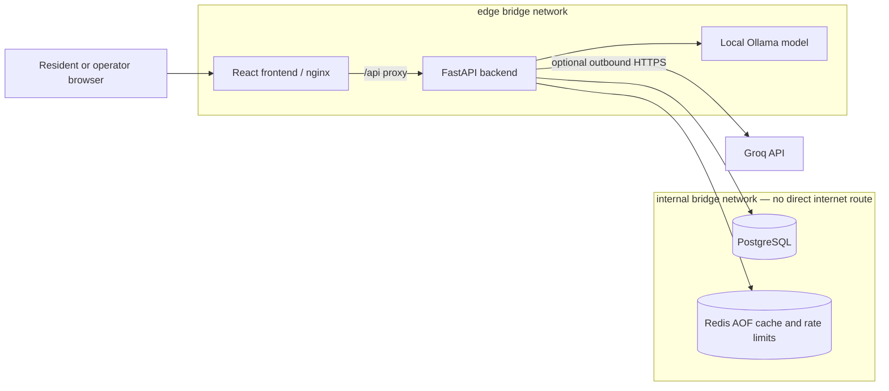

# CivicPulse

[](https://fastapi.tiangolo.com/) [](https://react.dev/) [](https://www.docker.com/)

CivicPulse is a municipal-complaint service. Residents submit a report, the service assigns a category and priority, and operations staff can track it through to resolution. It includes deterministic rules, a local Ollama model, and an optional Groq provider for triage.

## Architecture



The backend is deliberately the only service connected to both networks. The frontend cannot reach PostgreSQL or Redis directly. The backend can still make an outbound Groq request through its `edge` membership.

## Quick start

1. Install Docker Desktop and make sure it is running.
2. Optionally copy `.env.example` to `.env` and replace placeholder values only if you need Groq.
3. From this directory, run:

```powershell
docker compose up --build
```

The first start downloads the Ollama model (`llama3.2:1b` by default), so it can take several minutes and needs approximately 1.3 GB of download space. When the health checks are ready, open <http://localhost:5173>. Backend liveness is available at <http://localhost:8000/health>.

To stop the stack while retaining database, Redis, and model data:

```powershell
docker compose down
```

`docker compose down --volumes` also deletes those persistent volumes, so use it only when you intentionally want a fresh local database/cache/model download.

## Triage providers

| `TRIAGE_PROVIDER` | Use case | Network behaviour |
|---|---|---|
| `rules` (default) | Predictable local development | No model/API request |
| `simulated` | Repeatable failure-path testing | No model/API request |
| `ollama` | Offline/local model triage | Backend calls the local `ollama` service over `edge` |
| `llm` or `groq` | Hosted LLM triage | Backend calls Groq over outbound HTTPS; requires `GROQ_API_KEY` |

## API

| Method | Path | Purpose |
|---|---|---|
| `POST` | `/api/complaints` | Intake, triage, and persist a complaint |
| `GET` | `/api/complaints` | List complaints with filters and pagination |
| `GET` | `/api/complaints/{id}` | Get a complaint |
| `PATCH` | `/api/complaints/{id}/status` | Apply a valid status transition |
| `GET` | `/api/stats` | Get cached aggregate statistics |
| `GET` | `/api/meta/providers` | Inspect recent provider outcomes |
| `GET` | `/health`, `/ready`, `/metrics` | Liveness, readiness, and metrics |

## Operations and security notes

- PostgreSQL rows persist in `pgdata`; Redis AOF state persists in `redisdata`; downloaded Ollama models persist in `ollama_models`.
- The production file uses immutable image variables: `docker compose -f compose.prod.yaml up -d`. It has no source bind mount and does not publish PostgreSQL or Redis ports.
- To demonstrate database isolation after the stack is healthy, run `docker compose exec frontend ping -c 1 postgres`. It must fail because `frontend` only belongs to `edge`.
- Do not put a Groq key or database password in Git. Use `.env` locally and deployment secrets in production.

## Project documentation

- [Architecture decisions](docs/adr/)
- [Runbook](docs/RUNBOOK.md)
- [Engineering notes](docs/ENGINEERING-NOTES.md)
- [Evidence folder](docs/evidence/)

The evidence folder is intentionally kept in Git but does not yet contain screenshots or a demo video. Capture those after the full stack has been run and tested end-to-end.
