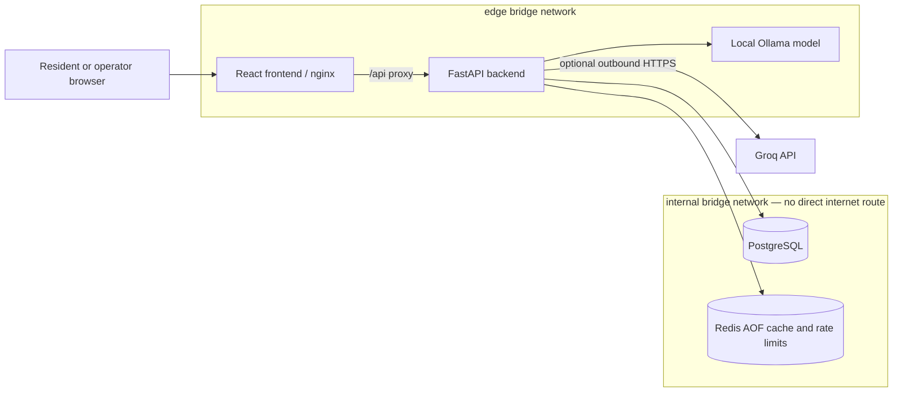

# CivicPulse

[](https://fastapi.tiangolo.com/) [](https://react.dev/) [](https://www.docker.com/)

CivicPulse is a municipal-complaint service. Residents submit a report, the service assigns a category and priority, and operations staff can track it through to resolution. It includes deterministic rules, a local Ollama model, and an optional Groq provider for triage.

## Architecture


```mermaid
flowchart LR
  browser[Resident or operator browser] --> frontend[React frontend / nginx]
  frontend -->|/api proxy| backend[FastAPI backend]
  backend --> postgres[(PostgreSQL)]
  backend --> redis[(Redis AOF cache and rate limits)]
  backend --> ollama[Local Ollama model]
  backend -->|optional outbound HTTPS| groq[Groq API]

  subgraph edge[edge bridge network]
    frontend
    backend
    ollama
  end
  subgraph internal[internal bridge network — no direct internet route]
    backend
    postgres
    redis
  end
```

The backend is deliberately the only service connected to both networks. The frontend cannot reach PostgreSQL or Redis directly. The backend can still make an outbound Groq request through its `edge` membership.

## Quick start

1. Install Docker Desktop and make sure it is running.
2. Optionally copy `.env.example` to `.env` and replace placeholder values only if you need Groq.
3. From this directory, run:

```powershell
docker compose up --build
```

The first start downloads the Ollama model (`llama3.2:1b` by default), so it can take several minutes and needs approximately 1.3 GB of download space. When the health checks are ready, open <http://localhost:5173>. Backend liveness is available at <http://localhost:8000/health>.

### Verify the complete complaint path

Submit a report in the web interface, then use these PowerShell commands to verify that the backend is ready and that the report was persisted:

```powershell
Invoke-RestMethod http://localhost:8000/ready

$complaint = Invoke-RestMethod -Method Post `
  -Uri http://localhost:8000/api/complaints `
  -ContentType "application/json" `
  -Body (@{
    text = "Water pipe burst near the school gate and the road is flooding."
    location = "Street 12, Gulshan"
  } | ConvertTo-Json)

$complaint
Invoke-RestMethod "http://localhost:8000/api/complaints/$($complaint.id)"
Invoke-RestMethod http://localhost:8000/api/meta/providers
```

For the default provider, `triaged_by` is `rules`. With Ollama enabled it is `llm:ollama`; if the model cannot answer safely, intake still succeeds with `rules:fallback`.

To stop the stack while retaining database, Redis, and model data:

```powershell
docker compose down
```

`docker compose down --volumes` also deletes those persistent volumes, so use it only when you intentionally want a fresh local database/cache/model download.

## Triage providers

| `TRIAGE_PROVIDER` | Use case | Network behaviour |
|---|---|---|
| `rules` (default) | Predictable local development | No model/API request |
| `simulated` | Repeatable failure-path testing | No model/API request |
| `ollama` | Offline/local model triage | Backend calls the local `ollama` service over `edge` |
| `llm` or `groq` | Hosted LLM triage | Backend calls Groq over outbound HTTPS; requires `GROQ_API_KEY` |

### Use the local Ollama model

The stack starts the Ollama container in every development Compose run, but the active triage provider remains `rules` unless you opt in. In an untracked root `.env` file, set:

```env
TRIAGE_PROVIDER=ollama
OLLAMA_BASE_URL=http://ollama:11434
OLLAMA_MODEL=llama3.2:1b
```

Then recreate the backend so it reads the changed setting:

```powershell
docker compose up --detach --force-recreate backend
```

Submit a new complaint sentence and inspect `GET /api/meta/providers`. A triage result is cached for 24 hours by the SHA-256 hash of its complaint text, so an identical sentence may legitimately return an older cached provider result after you switch providers.

## API

| Method | Path | Purpose |
|---|---|---|
| `POST` | `/api/complaints` | Intake, triage, and persist a complaint |
| `GET` | `/api/complaints` | List complaints with filters and pagination |
| `GET` | `/api/complaints/{id}` | Get a complaint |
| `PATCH` | `/api/complaints/{id}/status` | Apply a valid status transition |
| `GET` | `/api/stats` | Get cached aggregate statistics |
| `GET` | `/api/meta/providers` | Inspect recent provider outcomes |
| `GET` | `/health`, `/ready`, `/metrics` | Liveness, readiness, and metrics |

The valid status transitions are `open → in_progress → resolved`, plus `open → rejected` and `in_progress → rejected`. `resolved` and `rejected` are terminal states; an invalid request receives the backend's explicit `409` transition message.

## Operations and security notes

- PostgreSQL rows persist in `pgdata`; Redis AOF state persists in `redisdata`; downloaded Ollama models persist in `ollama_models`.
- The production file uses immutable image variables: `docker compose -f compose.prod.yaml up -d`. It has no source bind mount and does not publish PostgreSQL or Redis ports.
- To demonstrate database isolation after the stack is healthy, run `docker compose exec frontend ping -c 1 postgres`. It must fail because `frontend` only belongs to `edge`.
- Do not put a Groq key or database password in Git. Use `.env` locally and deployment secrets in production.

## Project documentation

- [Architecture decisions](docs/adr/)
- [Runbook](docs/RUNBOOK.md)
- [Engineering notes](docs/ENGINEERING-NOTES.md)
- [Ollama reliability behaviour](docs/OLLAMA-RELIABILITY.md)
- [Evidence folder](evidence/)

The evidence folder contains captured Docker, Kubernetes, and CI/CD screenshots. Add a short caption or capture command alongside new evidence so its purpose remains clear during assessment.
